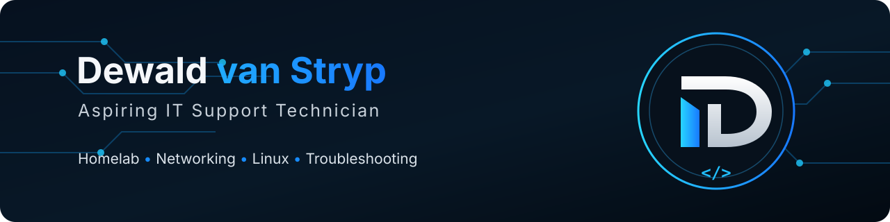

  

# 👋 Hi, I'm Dewald

### Aspiring IT Support Technician • Homelab • Linux • Proxmox • Networking • PC Hardware

I build, maintain, and experiment with my own homelab to gain hands-on experience with infrastructure, virtualization, networking, self-hosting, and troubleshooting.

🎓 **Currently studying:** CompTIA A+ Core 1 & Core 2

🌐 **Portfolio:** [dewaldvanstryp.github.io](https://dewaldvanstryp.github.io/)

📧 **Email:** [dewaldvanstryp.it@gmail.com](mailto:dewaldvanstryp.it@gmail.com)

## 🧰 Homelab Stack

  
  
  
  
  
  
  
  

## 🏠 My Homelab

I use my homelab as a practical environment for learning, testing, troubleshooting, and understanding how systems work.

- **Proxmox VE** — virtual machines and containers
- **Linux** — server and desktop environments
- **Docker** — self-hosted services and containers
- **ZFS** — storage management
- **Pi-hole** — network-wide DNS filtering
- **OPNsense** — networking and firewall experimentation
- **Home Assistant / ESPHome** — home automation
- **SMB** — network file sharing
- **Jellyfin** — self-hosted media
- **Sunshine & Moonlight** — local game and desktop streaming

## 🚀 Featured Project

### [🏠 Homelab Documentation](https://github.com/dewaldvanstryp/homelab)

A public, sanitized record of my real Proxmox homelab, including its VM/LXC layout, networking, storage, self-hosted services, monitoring, home automation, and the things I learn while operating it.

## 🔧 Areas I'm Interested In

- 🖥️ IT support and help desk
- 🏠 Homelab infrastructure
- 🌐 Networking
- 🐧 Linux
- 📦 Virtualization and containers
- 🔩 PC building and hardware
- 🛠️ Troubleshooting
- 🏠 Self-hosting
- 🤖 Automation

## 🌱 Currently Learning

I'm continuously expanding my hands-on knowledge of:

- CompTIA A+ Core 1 & Core 2
- Linux administration
- Networking
- Proxmox and virtualization
- Docker and self-hosted infrastructure
- Automation
- IT support and troubleshooting

---

  Learning by building, testing, breaking, troubleshooting, and improving.

